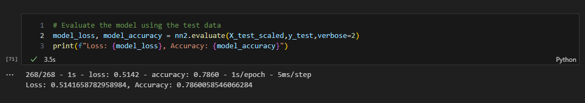

# deep-learning-challenge

The nonprofit foundation Alphabet Soup wants a tool that can help it select the applicants for funding with the best chance of success in their ventures. There is use of the features in the provided dataset to create a binary classifier that can predict whether applicants will be successful if funded by Alphabet Soup.

From Alphabet Soup’s business team, we have received a CSV containing more than 34,000 organizations that have received funding from Alphabet Soup over the years. Within this dataset are a number of columns that capture metadata about each organization, such as:

<i>
<li>EIN and NAME—Identification columns
<li>APPLICATION_TYPE—Alphabet Soup application type
<li>AFFILIATION—Affiliated sector of industry
<li>CLASSIFICATION—Government organization classification
<li>USE_CASE—Use case for funding
<li>ORGANIZATION—Organization type
<li>STATUS—Active status
<li>INCOME_AMT—Income classification
<li>SPECIAL_CONSIDERATIONS—Special considerations for application
<li>ASK_AMT—Funding amount requested
<li>IS_SUCCESSFUL—Was the money used effectively
</i>

From this set we removed the data/columns that were non-beneficial, 'EIN and 'NAME'.
The target variables used were the 'application' value count and the 'classification' count. 

For the application type data, we made a cutoff at T10 and by having the classificatin count, with values greater than 1, the cutoff value was at C2100. 
Next the categorial data was cnverted to numeric by using pd.get_dummies. After fitting and scaling the data the model was defined.
For this, in the 'AlphabetSoupCharity.ipynb' file, the input features used where the lenght of the x_train_scaled[0]. 
Two layers were used for the model, the first layer was 6, and the second layer 2. When the model was first ran, the accuracy accerted a 76%. However, as the model was ran multiple times, the accuracy kept decreassing, from 74% to a final accuracy of 65%. This model can be found as a HDF5 file named 'AlphabetSoupCharity'. 

This to obtain an accuracy of at least 75% or more, an optimization file was created with three move attempts. The process was the same for these modules up to the hidden layer values. 

A 78% accuracy was obtained in the 2nd attempt of the model. 
For this model we only implemented 2 hidden layers. The first layer had 8 units and the second layer 2. Left the output layer as 1 unit. The results from the attempted modules can be found in 'AlphabetSoupCharity_Optimization(h5)'.
